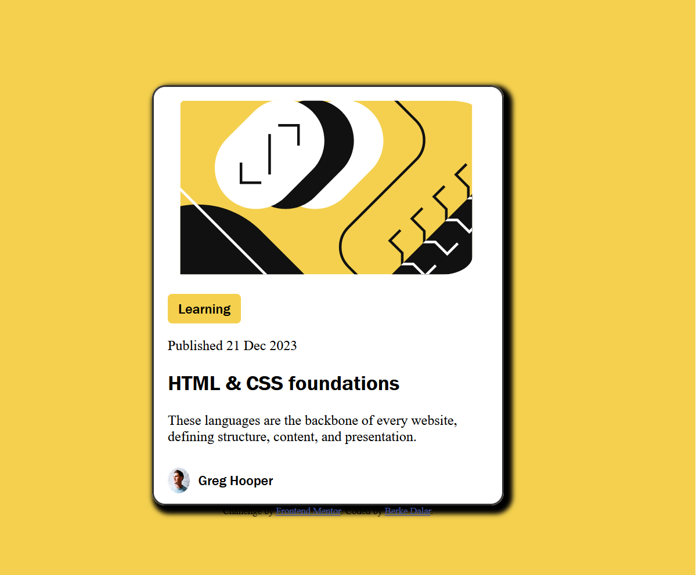

# Frontend Mentor - Blog preview card solution

This is a solution to the [Blog preview card challenge on Frontend Mentor](https://www.frontendmentor.io/challenges/blog-preview-card-ckPaj01IcS). Frontend Mentor challenges help you improve your coding skills by building realistic projects. 

## Table of contents

- [Overview](#overview)
  - [The challenge](#the-challenge)
  - [Screenshot](#screenshot)
  - [Links](#links)
- [My process](#my-process)
  - [Built with](#built-with)
  - [What I learned](#what-i-learned)
  - [Continued development](#continued-development)
  - [Useful resources](#useful-resources)
- [Author](#author)
- [Acknowledgments](#acknowledgments)


## Overview

### The challenge

Users should be able to:

- See hover and focus states for all interactive elements on the page

### Screenshot




### Links

- Solution URL: (https://github.com/jariwarlord/BlogPrev)
- Live Site URL: (https://blog-prev.vercel.app/)

## My process
Using figma and understanding it very important for me, it gave new perspective about design & coding.

### Built with

- Semantic HTML5 markup
- CSS custom properties
- Flexbox
- CSS Grid
- Figma

### What I learned

Different shadows and using box-shadow like that also making border like that was important.
To see how you can add code snippets, see below:

```html
<h1>Some HTML code I'm proud of</h1>
```
```css
.card{
box-shadow: 5px 5px 5px 5px rgba(0, 0, 0, 2.0);
background-color: white;
border-radius: 15px;
width: 400px;
border: 2px solid rgba(2, 1, 1, 0.8);
}
```


### Continued development

Use this section to outline areas that you want to continue focusing on in future projects. These could be concepts you're still not completely comfortable with or techniques you found useful that you want to refine and perfect.


## Author

- Website - [berkedalar4](https://medium.com/@berkedalar4)
- Frontend Mentor - [@jariwarlord](https://www.frontendmentor.io/profile/jariwarlord)
- Twitter - [@berkedalar4](https://x.com/berkedalar4)

